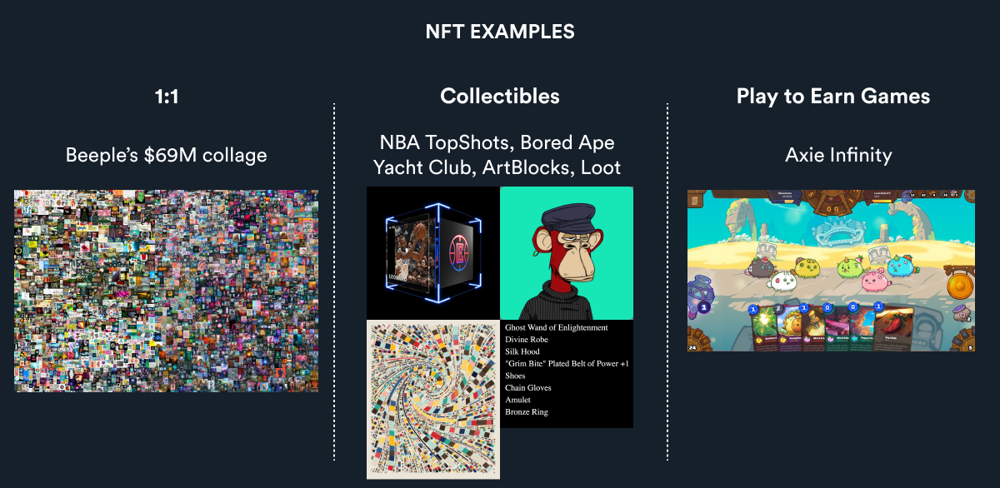

# 1. 什么是NFT

非同质化代币 (NFT) 是独一无二的（例如艺术、音乐、域名NFT）

同质化代币 (FT) 是可以互换的（例如美元、比特币）

NFT示例如下，可以理解为链上唯一的数字资产，在链上拥有相应的资产说明。&#x20;

<figure><figcaption></figcaption></figure>

由于 NFT 存于区块链上，所以它们具有以下三个特性：

去中心化：存储在各个计算机网络节点上

不可变：一旦创建就无法更改

公开透明：任何人都可以看到交易历史

#### NFT的应用场景

体育：球队，球员的图片或视频可以上传成NFT。

艺术：除个人创作外，由代码自动生成的艺术品也可以上传成NFT。

社交: 个人头像（PFPS）类NFT可以代表自己的虚拟形象或者作为加入特定社区的凭证。徽章类NFT是进入私有社区的凭证，拥有优先获得免费空投的权利。

游戏 ：玩家在游戏中购买的道具都以NFT的形式存在。 例如知名游戏Axie Infinity在菲律宾等发展中国家尤其受欢迎，玩家可以通过买卖NFT资产赚取收益。

地产：玩家可以在像Decentraland这样的平台买卖虚拟土地NFT资产。

音乐：音乐家可以将创作的歌曲变成NFT资产，售卖后获得的资金可以继续支持他们创作。

在未来，我们可以在元宇宙世界里体验更多的现实生活中场景，而NFT会被更广泛地应用。

#### 参考项目链接

Bored Ape Yacht Club：https://opensea.io/collection/boredapeyachtclub

CryptoPunks：https://www.larvalabs.com/cryptopunks

Tom Brady’s Autograph series：https://autograph.io/details/60fba00ed61cd2000f4723f5/nft

Axie Infinity：http://axieinfinity.com/

Decentraland：https://decentraland.org/

Royal：https://royal.io/
