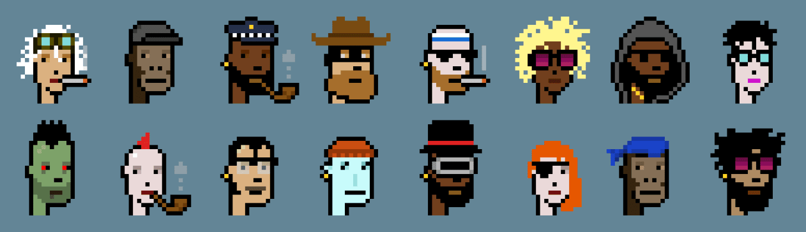
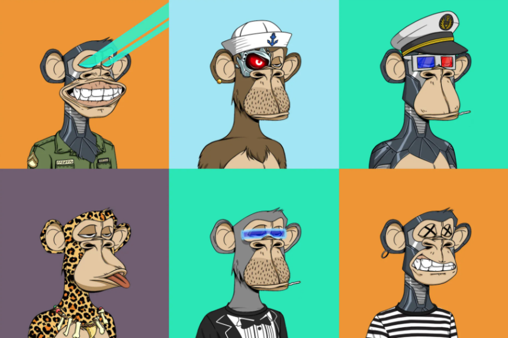
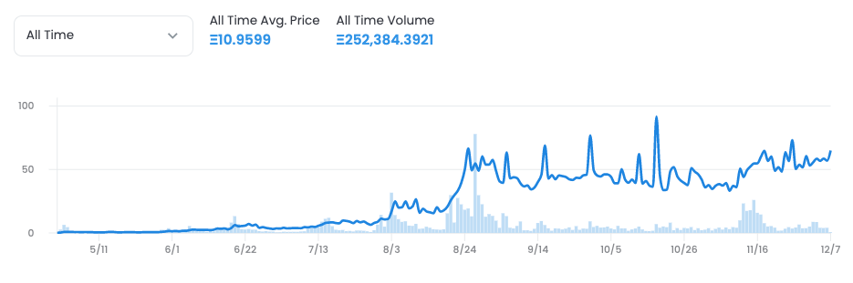
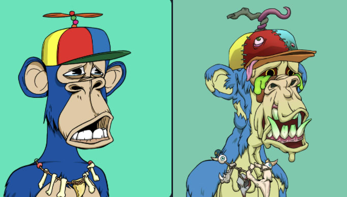
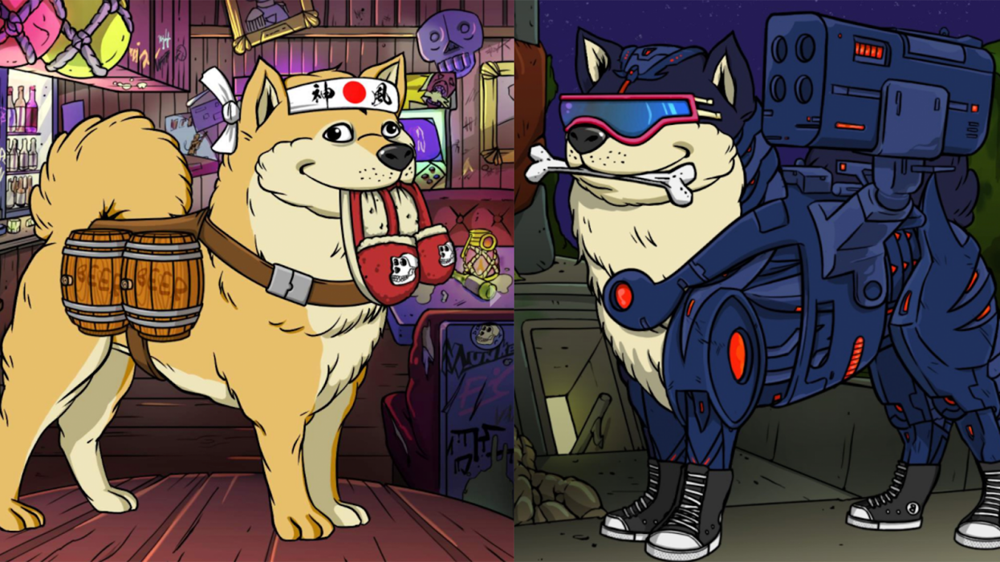

# 2. 为什么要购买NFT

主要有以下几个原因：

**1.欣赏艺术**

**2.身份象征**

**3.赚取利润**

**4.支持事业或创造者**

**5.加入社区**

我们以 Bored Ape Yacht Club 为例详细探讨每个原因。

#### 1.欣赏艺术

很多人购买 NFT 可能只是因为他们欣赏艺术或认同它的文化价值，比如无聊猿对很多人来说就具有极强的收藏价值。我们要理解无聊猿艺术的吸引力，可以从加密朋克开始（头像类NFT项目）。

CryptoPunks 于 2017 年推出，拥有 10000 个像素化的朋克 NFT。在接下来的三年里，越来越多的名人将朋克作为社交头像，所以它的价值也一路飞长。截至2021 年 12 月，朋克的最低价格为 94 ETH，即 35.3 万美元。在 2021 年初，CryptoPunks 是唯一一个头像类的 NFT 知名项目，而当时的市场更专注于收藏数字艺术和 NBA 体育收藏品。

无聊猿俱乐部的创始人看到了一个机会，他们以 Gargamel 和 Gordon Goner 的笔名，花了 40000 美元招募了两名区块链程序员，创造了 10,000 只具有独特表情的潮流街头猿猴。与 Cryptopunks 相比，Bored Ape 艺术脱颖而出，吸引了大批收藏家参与该项目。

#### 2.身份象征

人们购买 NFT 表明他们专属一个社区。当无聊猿在 2021 年 4 月推出时，知名 NFT 收藏家将无聊猿更新为他的新社交头像后，所有10000 只无聊猿在一夜之间售罄。社区成员也被鼓励使用#ApeFollowApe 等主题标签来帮助项目方推广这个无聊猿。从那时起，Twitter 上的许多公众人物将他们的头像更改为无聊猿，以表明他们专属这个社区。

#### 3.赚取收益

很多人能长期持有某个 NFT 是因为他们希望能获得翻倍利润。对于新 NFT 项目来说，价格翻成地板价的几倍很常见，无聊猿猴就是其中一个典例。正如这张 OpenSea 图表所示，早期出售无聊猿的人后期错过了巨大的收益。

无聊猿现在是一个蓝筹 NFT 项目，大多数人都会选择长期持有获得其他的免费空投。例如，无聊猿持有者在 2021 年 8 月获得了免费突变猿 NFT 空投，这个突变猿 NFT 在短短 1 小时内涨到了 9600 万美元。

#### 4.支持看好的事业或创造者

人们购买 NFT 来支持他们所看好的事业或创造者。2021 年 6 月，每个猿类持有者都可以免费铸造一只犬类伴侣 NFT。该社区成员通过二次销售这些犬类 NFT，为动物收容所筹集到了 100 万美元。

#### 5.加入社区

人们购买 NFT 就可以成为社区成员。Bored Ape 社区之所以脱颖而出，是因为它有清晰的路线图、透明公开的沟通氛围和良好的 共同创作环境。

**清晰的路线图规划**

早期无聊猿推出了详细的路线图来突出拥有猿猴的好处。但真正吸引人们的是后续持续不断的犬类和变种猿 NFT 空投。以下是无聊猿神秘的路线图：

<figure><figcaption>
无聊猿路线图 2.0
</figcaption></figure>

**透明公开的沟通方式**

Bored Ape 的创始人定期向社区更新项目进展。大家很喜欢这种直接与创始人和其他高级别社区成员沟通的方式。

**社区共创模式**

无聊猿持有者拥有完全商用 NFT 的权利。这便使得拥有者可以利用无聊猿 IP 的影响力为自己的商品引流。这样也帮助项目方更好的宣传无聊猿。

#### 扩展资料：

Status Monkey：https://www.notboring.co/p/status-monkeys
