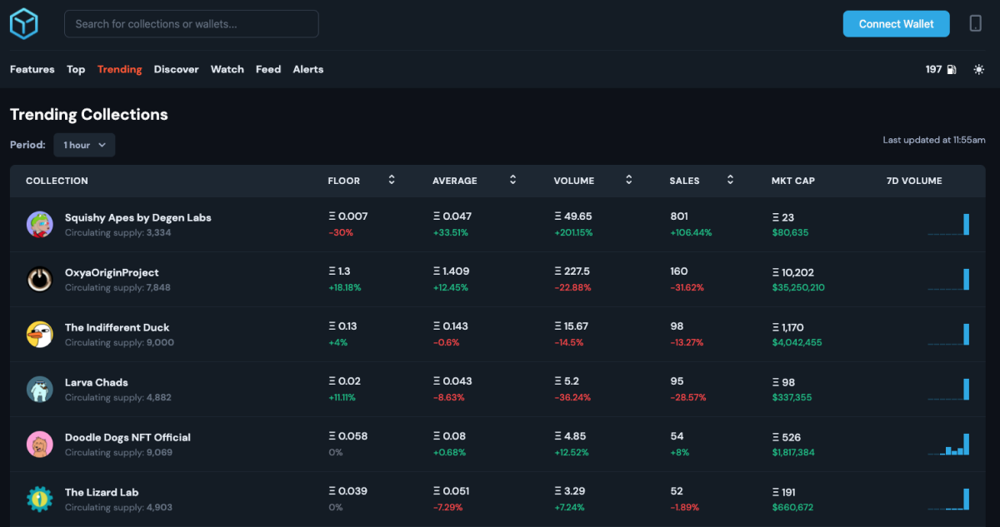
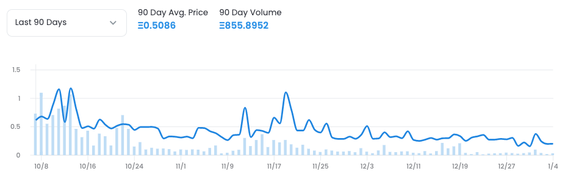

# 3. 如何寻找评估NFT项目

为了找到一个有潜力的 NFT 项目，我们需要先了解市场，我们建议这样做：

**1.设定目标**

**2.寻找项目**

**3.做调查研究**

**4.购买 NFT**

#### 设定目标

在购买 NFT 之前，需要考虑购买目的：

1. 如果只是想学习NFT项目，我们可以考虑买基于L2链或非Eth L1链的NFT来节省Gas fee，如 Polygon 和 Solana。
2. 如果是为了支持创作者或只是喜欢艺术， 那需要寻找具体项目。
3. 如果是为了投资赚钱，我们需要知道 NFT 是高风险的。蓝筹项目投资成本很高，很多新项目发展到一半都失败了。因此 NFT 投资者需要多研究 Alpha类项目，早期参与进去。

#### 寻找早项目

有几种方法可以找到有趣的项目：

**1. 寻找热门项目**

我们可以在 OpenSea，CryptoSlam 和 NonFungible 上找热门项目。还可以使用付费 NFT 工具，如 Icy.tools, Nansen, and Moby.gg 来寻找最新热门项目。

Icy.tools：可以看近期最新最流行的 NFT

**2. 关注 NFT 收藏家**

我们可以在 Twitter 上关注知名收藏家。他们不仅会大量交易 NFT，还能在第一时间找到最新热门项目。像 Moby.gg 这样的工具就可以看收藏家最近的交易。

**3. 加入 NFT 社区**

我们可以加入 NFT 爱好者的社区，获取最新项目资讯。知名 NFT 社区通常需要付费加入，例如社区 Metaverse, FWB 和 CPG Club。

#### 做调查研究

找到新项目后，我们需要查看它的官方链接，例如：Website,Twitter，Discord,Youtube,Telegram。加入社区去进一步了解官方规划：

1. 愿景： 该项目想要实现什么目标？这个愿景是否与你切合？
2. 团队：团队创始人是谁？核心团队技术背景如何？之前有开发过其他项目吗？资方是 谁？
3. 路线图：该项目是否有清晰的发展规划？例如，近期是否会给 NFT 持有者发新空投？
4. 社区：社区的核心成员是否活跃？社区里有多少活跃的成员？社区成员们是否期待项目发展并不断为社区做出贡献？或者他们都只是投机客？
5. 市场：知名 NFT 收藏家是否都在关注这个项目？近期项目方在推特上推广什么活动？

如果该项目已经发行，我们可以访问其 NFT 二级交易市场来查看它的交易情况。

1. 验证：项目是否经过权威验证？有时诈骗者会借用知名项目的名字给自己的项目做推广。
2. 所有者：每个人持有多少个 NFT？每个人持有 2-3 个 NFT 是正常情况，表明该项目没有集中在少数收藏家手中。
3. 地板价： 地板价是否保持不变？如果有很多地板价，这表明很多人要抛弃该项目。
4. 稀有度：稀有度体现 NFT 的价值。收藏家经常从一个项目中寻找最稀有的 NFT。我们可以使用 rarity.tools 和 howrare.is 分别来查看以太坊和 Solana 上 NFT 的稀有度。

#### 购买 NFT

做完市场调查研究后，我们就可以决定是否要购买 NFT。我们可以通过以下方式购买：

1. 铸造项目方的 NFT
2. 在二级市场上购买 NFT

#### 参考链接

**平台链接：**

Opensea：https://opensea.io/rankings

CryptoSlam：https://cryptoslam.io/

NonFungible：https://nonfungible.com/

Icy.tools：https://icy.tools/

Nansen：https://www.nansen.ai/

Moby.gg：https://moby.gg/

Rarity.tools：https://rarity.tools/

Howrare.is: https://howrare.is/

**社区：**

Metaverse：https://twitter.com/Metaverse\_HQ

FWB: https://twitter.com/FWBtweets

CPG Club：https://twitter.com/CPGclub

#### 扩展资料

Top 7 寻找最棒的NFT工具：

https://beincrypto.com/learn/nft-tools/#h-the-top-7-nft-tools

如何从NFT获利 ：

https://twitter.com/chriscantino/status/1475488321187024897?s=20
