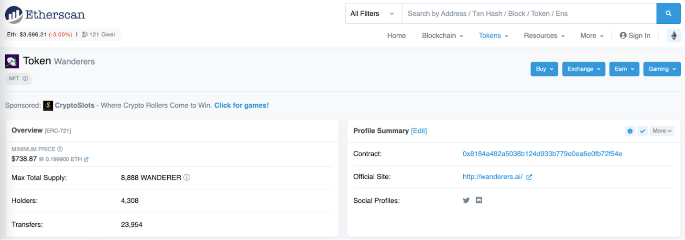

# 4. 铸造NFT秘籍

铸造项目方的 NFT 费用往往比在二级交易市场里购买的 NFT 要便宜。为了铸造项目方的 NFT，我们需要：

**1. 加入社区**

**2. 登陆项目方的网站铸造 NFT**

**3. 在智能合约里铸造 NFT**

#### 加入社区

加入项目方的 Discord 获取最新消息，例如：白名单，OG 身份，空投活动消息等。热门项目通常会有白名单，加入白名单后我们可以获得早期空投（铸造 NFT）。

如何加入到项目方的白名单中：

1. 参与社区的话题讨论，为社区做贡献。
2. 参与社区公告频道的 Giveaways 活动，例如项目方需要我们完成关注推特，加入 Discord，转推，@5 个好友等操作。
3. 持有项目方之前发行的 NFT。例如所有无聊猿猴持有者可以免费铸造一个陪伴犬 NFT。

注：忽略 Discord 社区中陌生人发来的 DM 消息，他们很有可能是骗子。

#### 登陆项目方的网站铸造 NFT

在铸造 NFT 之前，我们需要了解：

1. NFT 会基于哪一条链进行铸造，例如 Ethereum, Polygon, Solana。
2. 我们的钱包中是否有足够的代币来支付 Gas fee。

铸造过程：

1. 连接钱包
2. 铸造 NFT
3. 付铸造的 Gas fee

#### 在智能合约里铸造 NFT

我们在铸造热门项目 NFT 时，经常会遇到官网卡着不动的情况，这是因为同一时间有大量人在铸造 NFT。为了避免抢不到 NFT 的情况，我们可以直接在项目智能合约里铸造 NFT。

1. 向项目方要合约地址或在像 Etherscan 这种网站上寻找合约地址

2\. 钱包连接合约

在 Etherscan 上，我们可以点击 Contract，点击 Write Contract，再点 Connect to Web3，最终将我们的钱包连接到合约。

<figure><figcaption>
在合约上点击 Mint 功能
</figcaption></figure>

3\. 在合约上点击 Mint 功能

<figure><figcaption></figcaption></figure>

4\. 填写下面的信息后再点击 Write

<figure><figcaption></figcaption></figure>

#### 参考平台链接

Etherscan：https://twitter.com/chriscantino/status/1475488321187024897?s=20
