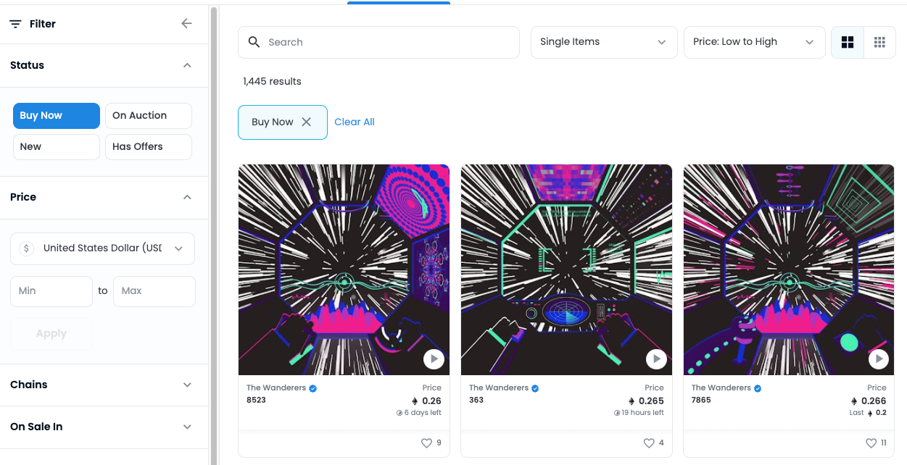
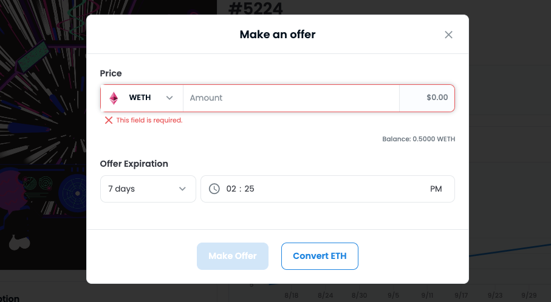

# 5. 购买NFT攻略

#### 目前 NFT 交易平台有：

1. Opensea：基于 Ethereum 和 Polygon 链的 NFT 交易平台
2. Solanart, Magic Eden, and SolSea：基于 Solana 链的 NFT 交易平台
3. Foundation 和 Rarible：基于 Ethereum 的 NFT 交易平台
4. LooksRare 是去中心化的 NFT 交易平台

#### 在 Opensea 上直接或者竞价购买 NFT

1. 点击 Buy now (现在购买)直接购买正在出售的 NFT

<figure><figcaption></figcaption></figure>

2\. Make offer (竞价)

竞价购买 NFT 意味着 NFT 所有者接受你出的购买价。为了能够竞价购买，我们需要付将 ETH转换成 WETH (wrapped eth)的 Gas fee。

具体操作过程可以参考：

Opensea’s WETH guide:&#x20;

https://support.opensea.io/hc/en-us/articles/360063498293-What-s-WETH-How-do-I-get-it-#:\~:text=To%20add%20WETH%2C%20click%20on,list%20on%20the%20MetaMask%20extension.

#### 参考平台链接

OpenSea ：https://opensea.io/

Solanart：https://solanart.io/

Magic Eden：https://magiceden.io/

SolSea：https://solsea.io/

Foundation ：https://foundation.app/

Rarible：https://rarible.com/

LooksRare：https://looksrare.org/
