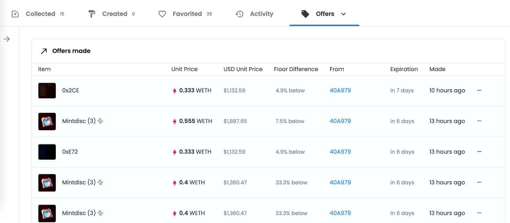

# 6. 售卖NFT技巧

售卖NFT主要有以下几步：

**1. 设定售价**

**2. 挂售 NFT**

**3. 接受竞价价格**

#### 1. 设定售价

为了设定一个合适的售价，我们需要考虑：

1. 价格变化
2. 稀有度
3. 出售 NFT 后产生的其他费用

**价格变化**

我们以 NFT 项目 PEACEFUL GROUPIES 为例：

地板价（floor price）：这是 NFT 项目里的最低售价，在 Opensea 上我们可以点击 Buy now(现在购买)去看有多少 NFT 以地板价出售，如果有很多 NFT 以地板价挂售，那就说明很多人要抛弃这个项目。

平均历史价格：我们可以观察最近 30 天的平均售价，最好选择平均价格不断上涨的时候卖出。

**稀有度**

不同 NFT 会有不同的稀有度，一般情况下，稀有度越高售价会越高。我们以 NFT 项目 PEACEFUL GROUPIES 为例：

我们点击（特性）来看这个 NFT 的稀有度，这个 NFT 的稀有度属性是 Horns Devil，稀有度是 0.36%，表明只有 0.36%的人持有这类 NFT。

我们点击属性 Horns Devil，再点击 Buy now 观察所有现在挂售 NFT 的价格，我们可以关注下这类 NFT 的最高售价，这便于我们选择合适的挂售价。

**出售 NFT 后的费用**

我们卖出 NFT 后交易平台，原创作者，以太坊还需要收取一些费用。

交易市场的交易费用：我们在 Opensea 上卖出 NFT 后平台会收取 2.5%的交易费用

版税费用：卖出 NFT 后，原创作者最高可抽取 10%的版税费用

交易费用：由以太坊收取，用于支付矿工处理交易进程

在考虑过以上三个影响售价的因素后，接下来我们可以挂售 NFT 了。

#### 2. 挂售 NFT

在 Opensea 上我们可以用以下 2 种形式出售 NFT:

**固定价格**

这种出售方式很常见，我们只要设定 NFT 的价格，选择挂售的有效时长。

**限时拍卖**

这种一般都是出售稀有的 NFT。我们需要设定拍卖有效时长，出售底价，我们最终可以选择卖给出价最高的那个人。

#### 3. 接受竞价价格

**接受公开出售**

买家直接以我们标的售价购买了 NFT，这是最直接方便的出售方式。

**接受公开竞价**

这种情况下要小心出价低于我们售价的买家，他们有可能是机器人，专门低价批量竞标 NFT。为了避免遇到机器人，不损失利润，我们可以查看他们的主页判断他们是否近期批量低价竞标 NFT。

**接受私人转账**

我们可以直接将 NFT 分享给朋友或者是社区里的成员。在这种情况下，私人转账是可以直接从我们的钱包中执行的，所以我们一定要足够信任对方。

#### 参考平台链接：

NFT 项目 Peaceful Groupie NFT：&#x20;

https://opensea.io/assets/ethereum/0x4f89cd0cae1e54d98db6a80150a824a533502eea/96

#### 扩展资料：

如何在 Opensea 上卖 NFT 的详细攻略：

https://support.opensea.io/hc/en-us/articles/360063498333-How-do-I-sell-an-NFT-

What is WETH and how do I get it? (OpenSea）：

https://support.opensea.io/hc/en-us/articles/360063498293-What-s-WETH-How-do-I-get-it-

How do I buy NFTs? (OpenSea)：

https://support.opensea.io/hc/en-us/sections/1500000462261-Buying
