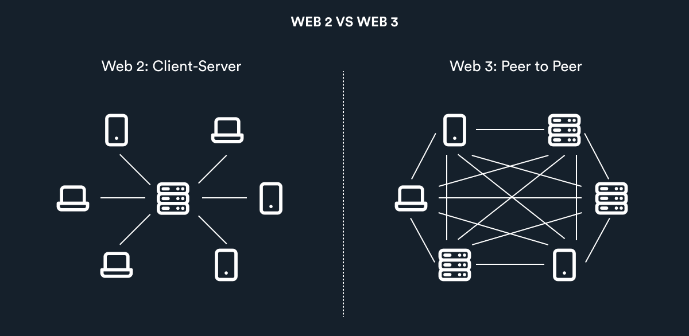

# Web1,Web2,Web3简介

Web1（1990-2000年代初）：是"只读"网络，人们只能通过浏览雅虎这些门户网站获取内容。

Web2（2000 年早期 - 至今）：是"可读"、"可写"的中心化网络。

人们可以通过微信抖音创作内容，但作品所有权都归平台所有，文章视频带来的收益大部分被平台瓜分，只有少数收益分到创作者手中。

Web3（2020+）：是"可读"、"可写"和"可拥有"的去中心化网络。

人们可以通过Web3平台创作视频文章，创作者不仅拥有作品的所有权，还能获得作品的全部收益。在Web3社区中，话语权归还于用户，人们可以共同自治管理社区，投票评定作品的价值。

##### 简单来说，Web1,Web2,Web3特点如下：

##### Web1: 可读

##### Web2: 可读, 可写

##### Web3: 可读, 可写, 可拥有

而Web3 与当前Web2 最大的区别就在于人们在Web3 中可以直接联系到其他用户，不再需要依靠中间商平台中转连接。

#### 深度思考
那么Web3 究竟能给我们带来什么，普通人能有什么机会？敬请期待Web3.0进阶课程

#### 扩展阅读
https://variant.fund/articles/the-ownership-economy-crypto-and-consumer-software/

 