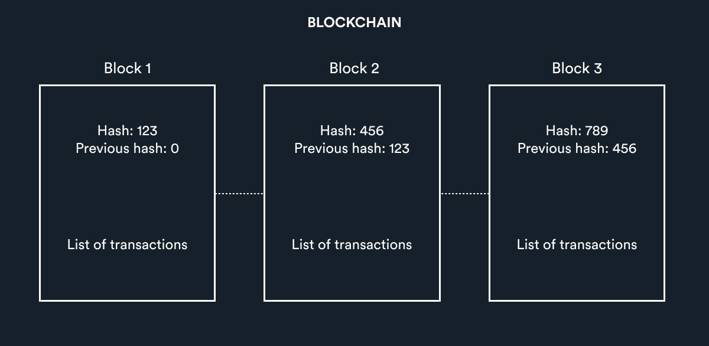
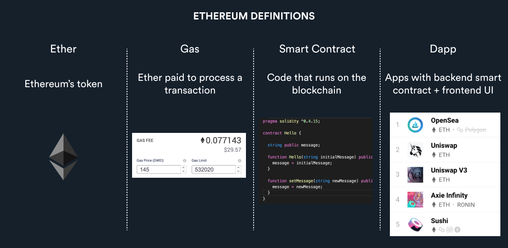

# Web3基本概念

### 什么是代币？
代币是资产所有权的凭证。分为同质化代币和非同质化代币。

同质化代币是可以互相兑换的，例如，美元、比特币就可以购买互相兑换。

非同质化代币 （NFT）是独一无二的，例如数字化资产艺术品，文章，图片及音乐等都可以铸造成NFT。比如大家可以在opensea上上传视频或图片就可以生成NFT。

##### 我们以Web3 社交平台Facedao为例：

平台所发的虚拟货币FACE就是同质化代币

平台用户所上传到链上的图片、视频就是非同质化代币 (NFT)

### 什么是区块链(Blockchain)？
区块链由区块组成，由示意图可见，每个区块包含：

1. 一系列的交易记录
2. 该区块的哈希值（即一长串的随机字符）
3. 上一个链接的区块的哈希值

链上所有的交易都会存储在区块链上，交易一旦开始，就不能逆转，交易过程清晰透明，数据任何人都可以查看。

详细介绍可参考以下网站的生动演示:

https://andersbrownworth.com/blockchain/

### 什么是比特币？
比特币由Satoshi Nakamoto于 2009 年创建，建立在区块链上，可以说是所有加密货币中最安全和去中心化的。由于永远只有 2,100 万比特币，所以目前具有很强的收藏价值。

### 什么是以太坊?
以太坊由 Vitalik Buterin 于 2013 年创建，旨在让任何人编写智能合约和去中心化应用程序。

#### Ether 
以太坊发的币是以太币。

#### Gas
交易过程中产生的费用。

#### Smart contract
智能合约是运行在以太坊上的代码。这些代码是去中心化的，一旦提交到区块链上就不能被更改，任何人都可以查看使用这些代码。

#### Dapp
去中心化应用程序，也是Web3项目的主要体验入口。

以太坊是 Web3开发者的聚集地。它像乐高积木一样，任何人都可以根据现有智能合约去创造新的项目,这便大大降低了开发者创建新项目的门槛。

例如：
NFT交易平台（Opensea）

互换代币平台 ( Uniswap )

借贷代币平台（ Compound ）

Play To Earn平台（ Axie Infinity) 

#### 深度思考
项目方为什么要发代币? 为什么大多数项目都部署在以太链上？敬请期待Web3.0进阶课程。

#### 参考平台链接
Facedao: https://mobile.twitter.com/facedaoio
