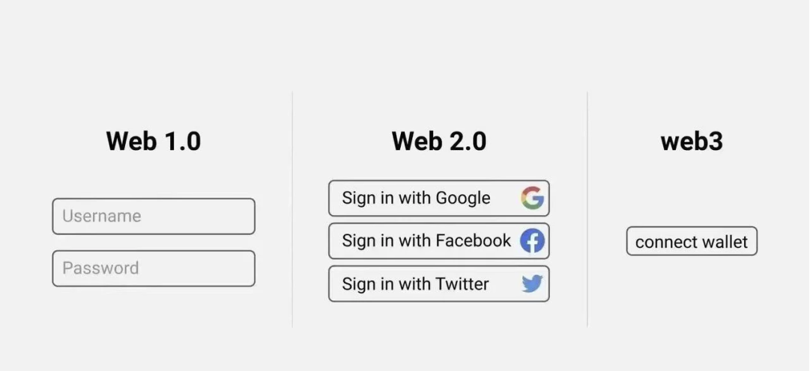
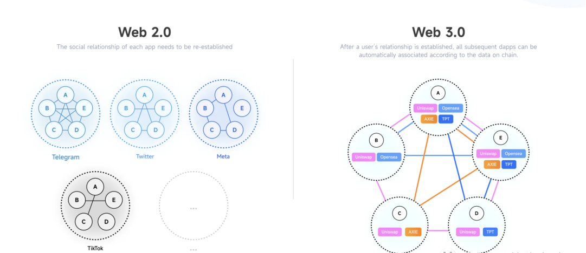

#  Web3究竟解决什么问题

### Web3主要解决问题

#### 用户注册 / 登录 / 使用产品的安全性低

 
Web1 :用户重复使用一套或几套密码登陆产品，账户密码泄露风险很大。

Web2: 用户通过 Google 微信跳转登录其他产品，不再需要向每个产品暴露密码，但账户安全性完全依赖这些大厂产品的安全性。

Web3: 用户通过钱包登陆产品，注册钱包时也无需绑定任何邮箱或手机号，钱包资产的私钥和助记词完全掌握在用户手中，极大程度上保障了账户的安全性和私密性。

#### 信息不共享 / 效率低
Web1 ：注册账户后，网站需要用户从个人信息开始为其提供各种信息。

Web2： 用户授权谷歌微信登录后，网站只能拿到账号的一些基本信息，例如头像、昵称或邮箱手机。

Web3：用户签署钱包授权后，网站能根据钱包内的资产快速了解用户的兴趣爱好。

他们不再需要像以前那样，从其他产品中购买用户数据。这便让很多Web3新项目通过信息共享，找到了适合自己产品的用户，精准定位出产品的发展方向。

### Web3在不同领域分别解决的问题

#### 金融

Web2中资产存储不透明公开，安全性低。

Web3金融产品的链上数据公开透明，我们可以很清晰的看到资产的去向和利率。这便解决了资产存储在Web2时安全性低的问题。

例如，有多少用户存了多少钱，以什么利率借走了多少，借款人抵押了价值多少的资产，资产利用率多少，从而看出整个系统的健康程度。

贷款的收益也会通过代码公平地分发给存款用户。通过代码合理的限制，只要保证抵押物的价值，任何人几乎是没办法从系统中私自转走钱的。

#### 游戏

Web2游戏道具交易不方便，无法永久存在。

Web3游戏中道具 NFT 化，游戏内货币上链。

GameFi是目前Web3中比较成熟的应用。道具NFT化可以理解为将游戏中获得的武器，皮肤，宝石，货币变成链上资产。

拥有NFT所有权的玩家不仅可以在链上验证道具真实的稀有度，还可以在不同的通用平台进行交易。即使游戏发行方倒闭，玩家所获得的资产也能任意切换到下一个游戏平台中。这便提高了交易的效率，给用户带来了更多赚钱方式。 

#### 社交

Web2中不同平台之间的数据不共享，中心化管理用户。
 
Web2 社交最大的问题：用户在切换社交平台后，发布的内容和建立的好友关系不能跨平台随意迁移，它们会随着平台的消失而丢失，而且平台有着处置这些内容的最高权力：封号，删帖，限制登录等。

而Web3社交就要把社交关系和产生的内容全部还给用户，将这些数据放在链上或其他去中心化的存储中，这样用户就可以在不同的平台来共享这些数据。

例如我们可以在微信里看到我们在 Twitter、Instagram 发的动态或图片。

在未来Web3社交会变得越来越垂直精准，我们通过登陆Web3社交平台后，可以根据钱包里持有相关的NFT快速精准的找到与我们兴趣相投的社群。例如无聊猿头像，mimic猫NFT社群。

#### 艺术音乐文学

Web2平台作品版权及收益不完全归用户所有

在Web2时代，中心化大平台对创作者的作品有绝对化的话语权，他们可以随意撤除更改作品。作为中间商，他们还可以抽取作品带来的大部分收益，极大程度上压榨了创作者的利益。

而Web3时代，去中心化平台将创作权，话语权，作品所获得收益全部还于用户。创作者在Web3平台上传作品后，例如opensea, 版权归创作者所有，作品转卖后还能持续抽取版税收益。

