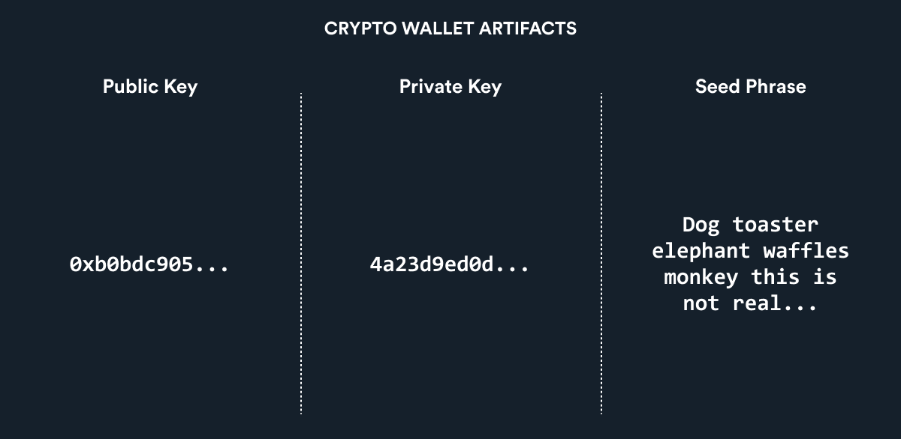
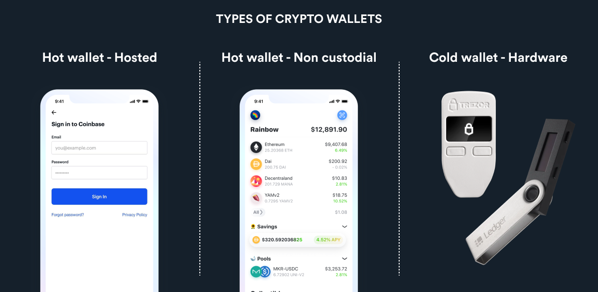
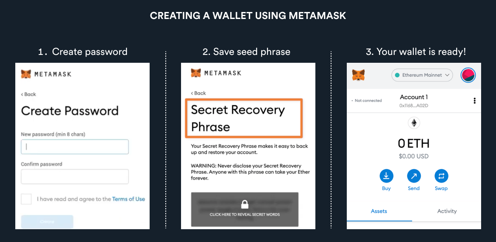

# 怎样使用加密钱包(Crypto Wallet)？

#### 加密钱包组成
加密钱包由公钥和私钥组成，分为热钱包(Hot Wallet)和冷钱包(Cold Wallet)。

公钥(Public Key)：交易时的链接地址（相当于银行帐户）

私钥(Private Key)：进入地址里资产的凭证（相当于账号密码）

助记词(Seed Phrase) ：12-24 个随机单词，可用来找回私钥

##### 注意事项
##### 我们和别人交易的时候需要出示公钥。
##### 我们绝不能泄露自己的私钥或助记词。

#### 冷热钱包简介

##### 我们建议：将大额资产存在冷钱包中，平时连接Web3平台用热钱包。

##### 热钱包利弊
热钱包比冷钱包更方便，但安全性更低。因为它们将助记词存在电脑里，很容易被黑客用网络追踪到。

目前有两种类型的热钱包：

托管钱包(Hosted Wallet): 由交易所管理,例如 Coinbase，用户可通过用户名和密码登录交易所进行交易，但没有自己的密钥。

非托管钱包(Non-custodial wallets)：由用户自我管理。因为用户拥有密钥，所以可以将这些钱包作为登陆Web3项目的身份。
目前使用最广泛的钱包有 MetaMask （用于以太坊）和 Phantom （用于Solana）。

##### 冷钱包优势
冷钱包会更安全，因为它将助记词存在默认离线的硬盘里，不易被黑客追踪。

大额不动资产建议存入冷钱包, 例如：Trezor和Ledger 中。

##### 如何创建热钱包?
以创建Metamask 钱包为例：

 
⦁	安装MetaMask。

⦁	选择 创建钱包。

⦁	MetaMask 中创建密码。

⦁	将助记词存储在安全的地方。

详细注册攻略可参考：https://www.youtube.com/watch?v=cxkXzTA9YIc
 
#### 深度思考
怎么使用冷钱包？ 如何将加密货币转到钱包里？敬请期待Web3.0进阶课程。

#### 扩展阅读
https://www.coinbase.com/learn/crypto-basics/what-is-bitcoin

https://ethereum.org/en/developers/docs/intro-to-ethereum/

#### 参考平台链接：
Opensea: https://opensea.io/

Uniswap: https://app.uniswap.org/#/swap?utm_source=StateOfTheDApps&

Compound: https://compound.finance/

Axie Infinity: https://axieinfinity.com/

