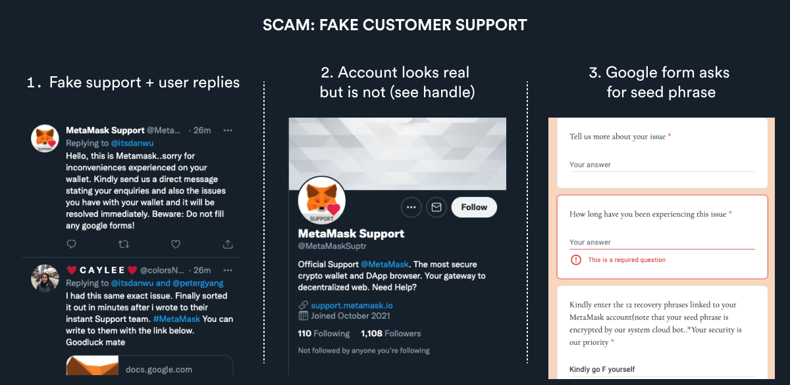
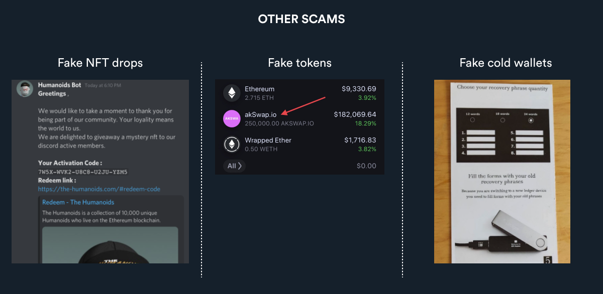

# 如何避免钱包诈骗？

#### 保护钱包的方法

1. 将私钥和助记词保存在安全的地方，比如记在纸上。

2. 切勿与任何人分享你的私钥或助记词。

3. 保护你的钱包密码。

4. 你经常用的热钱包中不要存入大额资产，将它们放入冷钱包。

5. 在用钱包连接任何web3网站之前，需要检查该网站域名地址、电子邮件或社交用户名。骗子会假装成一个权威的平台来钓取你的助记词。

6. 关闭Discord中的私信功能，不要与钱包中的未知资产进行交易。

#### 常见的钱包诈骗手段

骗子会让你提供私钥或助记词给他们，以下是常见的诈骗手段和避免被骗的方法：

##### 伪装成客服，例如："您的 Metamask 帐户已被盗"。

##### 识别方法：

首先一定要先验证该网站域名、电子邮件地址或社交用户名的真假。

请切记：没有官方平台会要求你提供私钥或助记词给他们。
 
##### 伪装成NFT或代币空投(token drops）

例如："我们将免费送你一个NFT，以感谢你对社区的支持"，或 "你的钱包在 akSwap.io 里有1.8万美元"。

##### 识别方法：

加入新的加密服务器时，关闭Discord私信功能。

不要用钱包与未知加密货币或NFT交易。

#### 扩展阅读
怎样创建小狐狸钱包：https://www.youtube.com/watch?v=AgK4xPhw8Fo

如何避免钱包诈骗（Rainbow）：https://learn.rainbow.me/

#### 参考平台链接
Metamask：https://metamask.io/

Phantom：https://phantom.app/

Trezor：https://shop.trezor.io/

Ledger：https://www.ledger.com/

Coinbase：https://www.coinbase.com/

Gemini：https://www.gemini.com/apac/hong-kong

 

