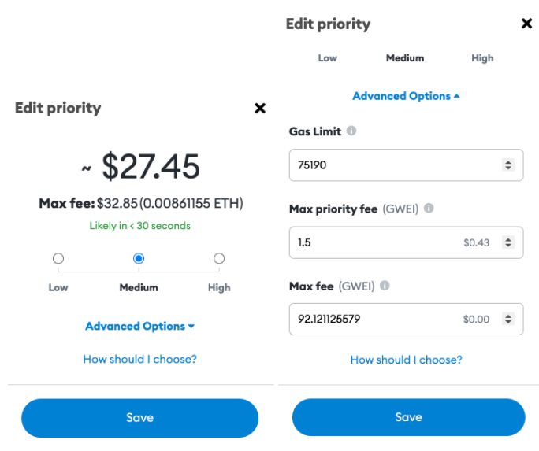

# 如何少付铸造费（Gas Fee)?

### 什么是铸造费（Gas Fee)？
Gas Fee是我们在区块链上交易时需要付的费用（例如：铸造NFT，发空投等)，其中以太坊的Gas Fee最贵。

##### 支付多少Gas取决于：

网络拥堵情况：如果很多人都在同一时段交易，那么Gas会很高。

交易类型：如果交易很复杂（例如：铸造NFT，将加密货币发送到另一个钱包），这类Gas Fee会更高。

### 如何在以太坊上少付Gas？
少付Gas Fee 意味着要延长交易时间。

#### 等待更低的Gas Fee出现

太平洋标准时间周末晚上 9 点到凌晨 1 点之间 Gas Fee 最低，我们可以登陆Etherscan 的gas tracker 追踪当前和历史Gas Fee, 寻找最低点入手。

#### 设置最高Gas Fee

在 Metamask 上，你可以在确认交易之前将Gas Fee设置为“低”。
如果想节省更多Gas Fee，单击高级选项,将最高Gas Fee设置为略高于 Etherscan 中的7 天最低历史费用。

设置较低的Gas fee意味着交易可能要花费一整天的时间，我们可以在Metamask的"活动"或 Etherscan上查看交易状态。

#### 换别的链

我们在以太坊上铸造NFT时需要花费大量的Gas Fee, 可以考虑换成Polygon 链免费铸造NFT。

很多平台目前都支持创作者使用Polygon链铸造 ，例如：Opensea, Showtime, Tellie,详细版免费铸造NFT的攻略可以参考《怎样铸造NFT》。

#### 扩展阅读
How to Set Your Own Gas Prices: https://medium.com/@maimai816/advanced-metamask-gas-tutorial-how-to-set-your-own-gas-prices-236d59f563b7

How to speed up or cancel a pending transaction：https://metamask.zendesk.com/hc/en-us/articles/360015489251

#### 参考平台链接
ens.domains：https://app.ens.domains/

Etherscan：https://etherscan.io/

Gas tracker: https://etherscan.io/gastracker#historicaldata
